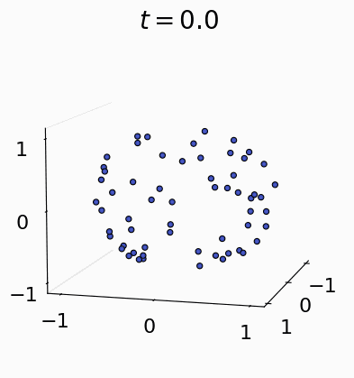

# Cluster Attention

We hypothesize that over time gradient descent and self-attention work together
to push similar objects in x (tokens input to transformer block) together, thereby forming clusters and that
there is alternative architecture component that can more effectively find these
clusters without repeated $O(n^2)$ operations.

[Full report](NLP_Project.pdf)

  

