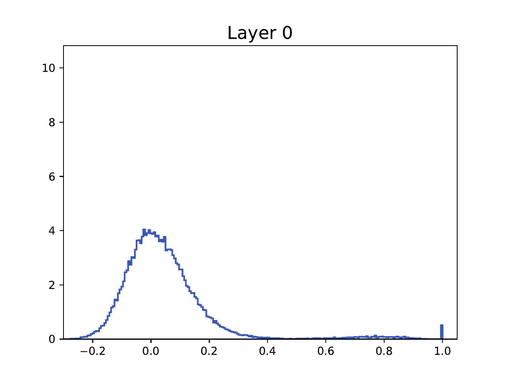
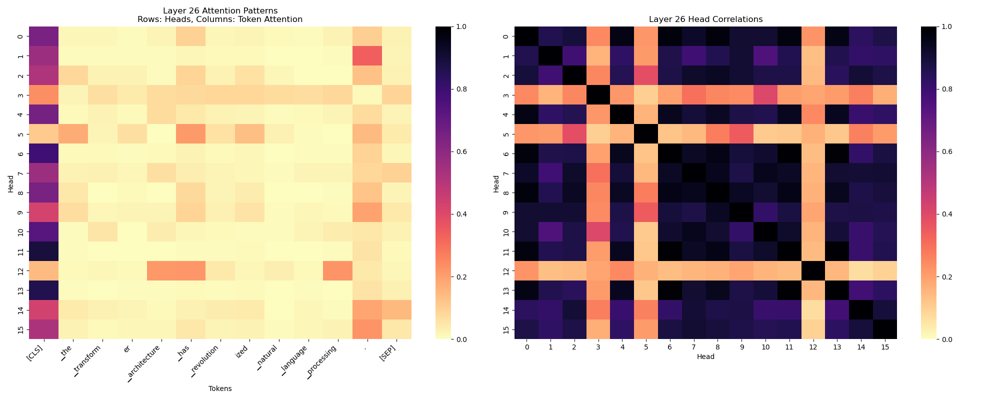
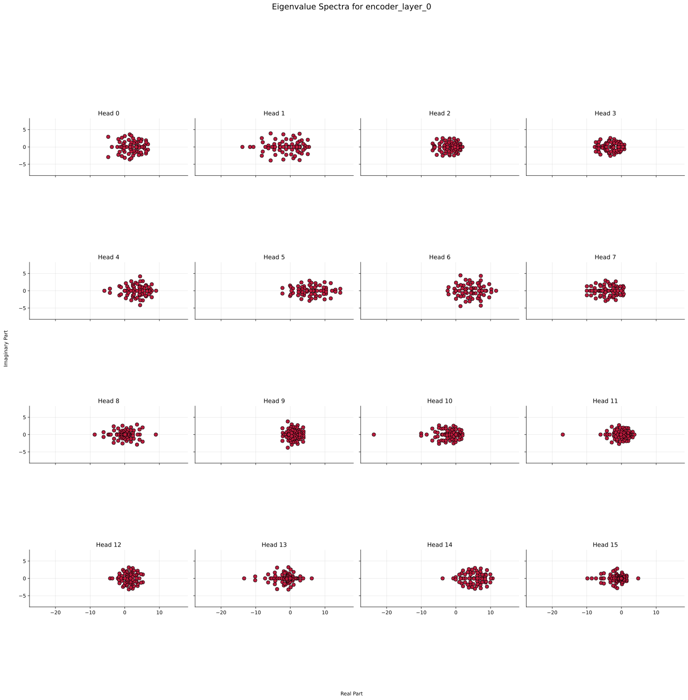

# Simulating Attention Dynamics

<p align="center">
  
</p>

## Generate Token Similarity Histogram

To generate and save histograms of token similarity from either ALBERT or T5, use:
```
python create_corr_histograms.py
```

<p align="center">
  
</p>

## Visualize the Attention Head Correlation and Token Activations

<p align="center">
  
</p>

```python
from gen_corr_plots import prepare_t5, evaluate_on_c4

# Analyze T5 model
tokenizer, model = prepare_t5('t5-large')
evaluate_on_c4(model, tokenizer)

# Or analyze ALBERT model
tokenizer, model = prepare_albert('albert-xlarge-v2', depth=48)
evaluate_on_c4(model, tokenizer)
```

To run the script as is:
```
python gen_corr_plots.py
```

## Run the Particle Simulation

Important configuration variables are defined at the top of the file:
```python
experiment = "baseline"

n = 64
T = 15
dt = 0.1
num_steps = int(T/dt) + 1
d = 3
beta = 1
denominator = True
half_sphere = False

V = np.eye(d)
A = np.eye(d)

Q = np.eye(d)
K = np.eye(d)

# TODO: uncomment to randomize Q,K
# Q = np.random.randn(d, d)
# K = np.random.randn(d, d)

project_residual = True
residual_strength = 0.0 # TODO: set to > 0 to add skip connections
```

Then run:
```
python particle_simulation.py
```

## Visualize T5 Eigenvalue Spectra

<p align="center">
  
</p>


```
python t5_eigenvalues.py
```

## Make a GIF

Set the path for the directory containing `.png`s or `.pdf`s

```
python make_gif.py
```